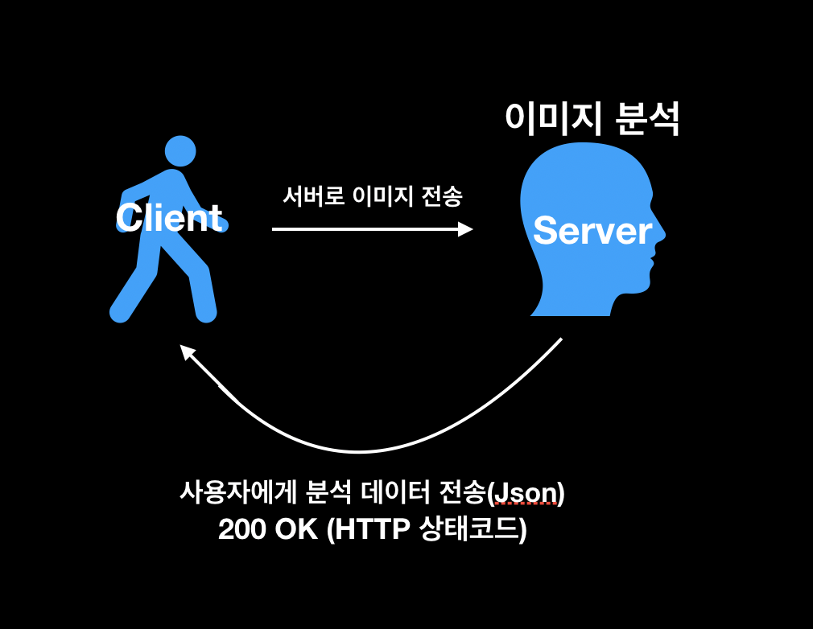
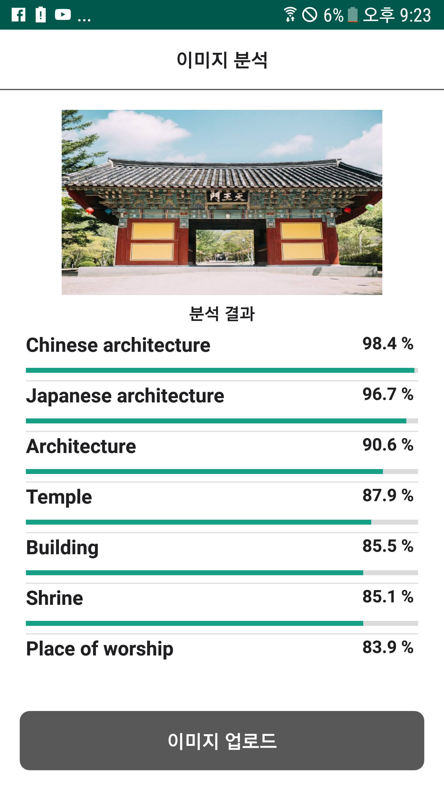
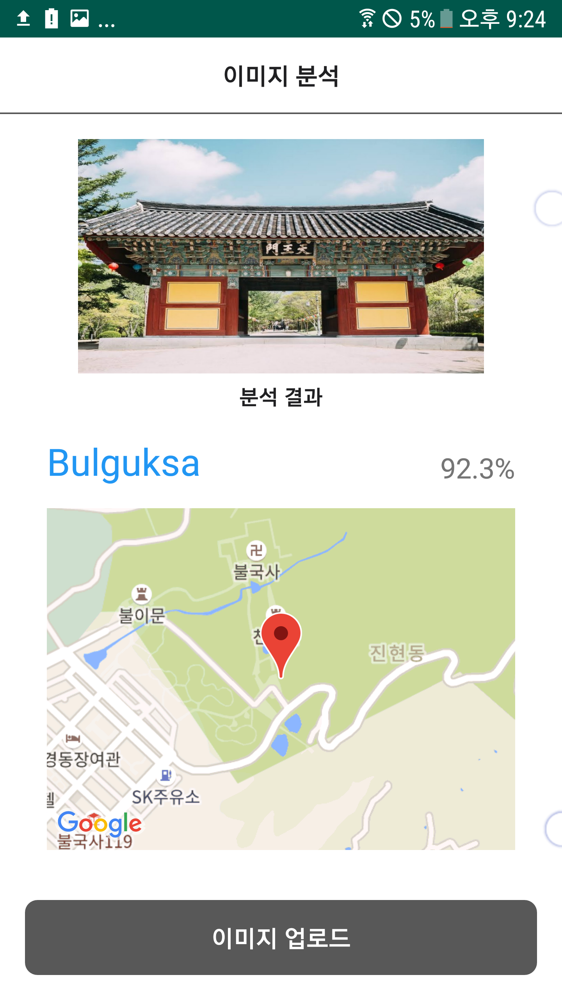

# 이미지 분석
  이 APP은 Google Cloud Platform의 Vision api 를 사용해 이미지를 추출해서 이미지를 2가지의 모드로 분석할수 있는 어플입니다.
  분석 모드로는 LABEL 분석과 LANDMARK 분석이 있고 분석 모드의 따라서 분석 결과가 다르게 나와
  사용자가 쉽게 이미지를 분석하고 분석의결과를 확연하게 확인할수 있는 어플 입니다.

  - 분석 절차
  </img>

## LABEL 분석
  LABEL 분석은 이미지에서 카테고리에 속하는 물체를 감지하여 관련 정보를 추출할 수 있다.
  라벨분석을 통해 물체, 장소, 활동, 동물종, 상품 등을 식별하여 사용자에게 그래프형태로 보기 쉽게 보여준다.

  </img>

## LANDMARK 분석
    LANDMARK 분석은 이미지에서 유명한 자연 경관과 인공 구조물을 감지해
    위치를 분석한뒤 사용자에게 Google 지도를 통해 해당 LANDMARK의
    위치를 알려주어 사용자가 해당 이미지가 어떤 장소인지를 좀더 확실하게
    알수 있다.

</img>

### library  
    - Google Vision API (이미지 분석을 제공하는 Google 라이브러리)
    - Google Map (LANDMARK 분석시 해당 LANDMARK의 위치를 보여주기 위해 사용)
    - Glide (사용자의 이미지를 빠르고 좀더 효과적으로 보여주기 위해서 사용)

### 어플 시연 영상

