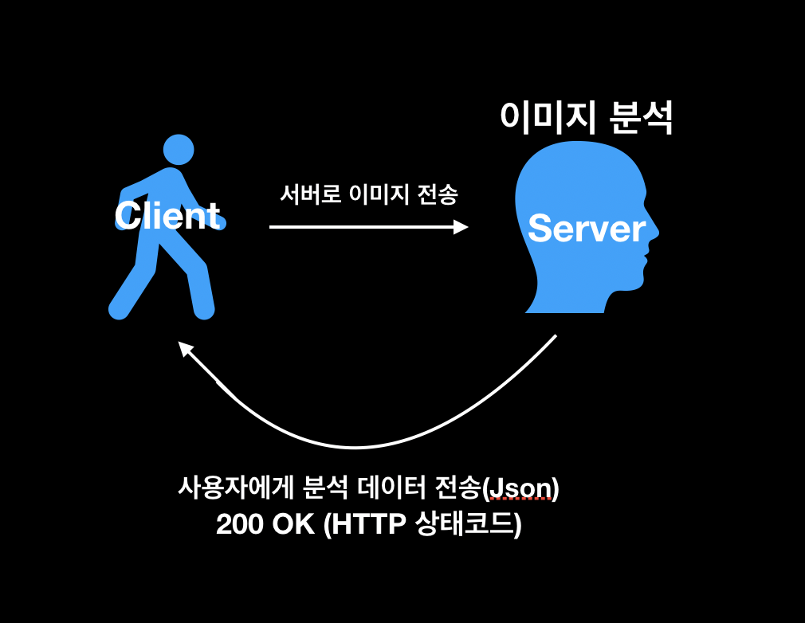
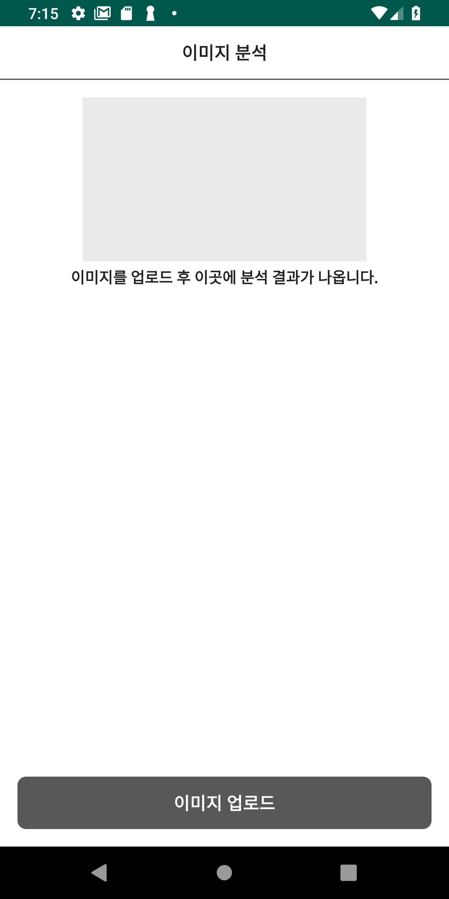
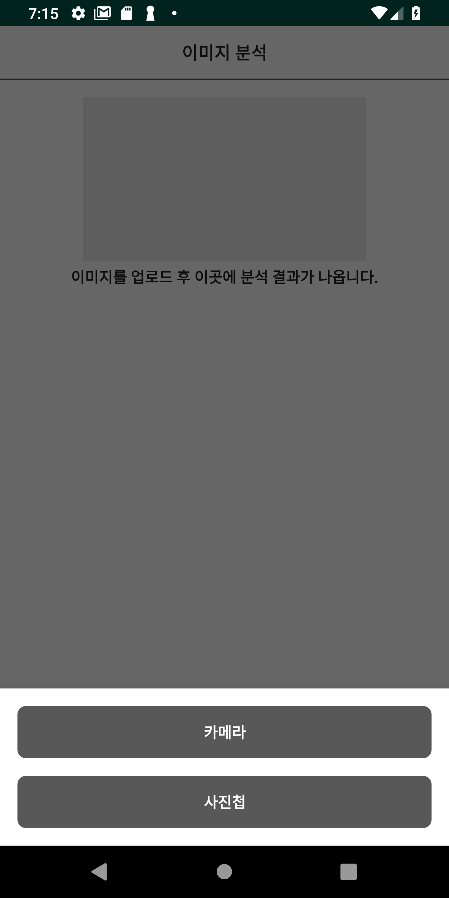
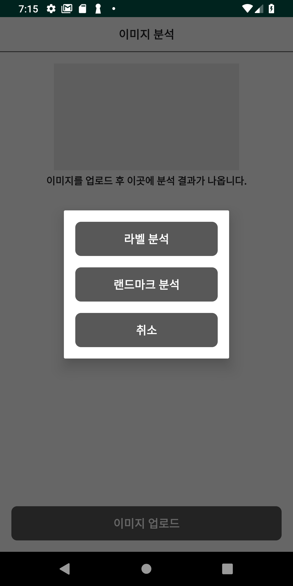
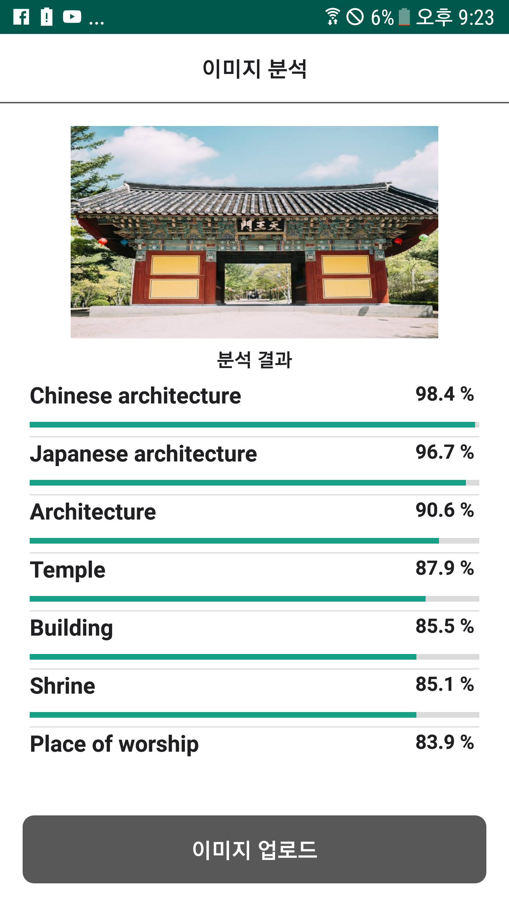

# 이미지 분석

  ## 1.개요

  Google Cloud Platform 의 Cloud Vision Api 를 사용한 이미지 분석을 할 수 있는 Android 어플 "이미지 분석" 입니다.

  ## 2. 개발 환경

  - OS : Mac Mojave( version : 10.14.5 )

  - 개발 언어 : Kotlin( version : 1.3.31 )

  - Tool : Android Studio ( version : 3.4.1 )

  - 외부 라이브러리 :

   |
Tool
  |
사용목적
  |
Version
 |
   |:---------------------:|:-----------------------:|:-----------------------:|
   | **Google Vision API**  | Google Cloud Platform 에서 제공하는 이미지 분석기능을 사용하기위해 추가 | 1.23.0 |
   | **Google Map** | LANDMARK 분석시 해당 LANDMARK의 위치를 보여주기 위해 사용 | 16.0.0 |
   | **Glide** | 사용자의 이미지를 빠르고 좀더 효과적으로 보여주기 위해서 사용 | 4.9.0 |

   ### 어플 시연 영상
   

## 3.이미지 분석 절차
  </img>

## 4. Apps Views
  #### - **Main**
  </img>

  #### - **사진 가져오기** ( 앨범 or 카메라 )
  </img>

  하단의 이미지 업로드 버튼을 터치하면 볼수 있는 다이얼로그(DialogFragment) 사용자에게 카메라권한 과 저장소 권한을 받아 앨범과 카메라에 접근을 해 사진을 가져올수 있다.

  #### - **분석 모드 선택**
  </img>

  사진을 가져온뒤 어떤 분석을 진행 할것인지 묻는 다이얼 로그 분석 모드에 따라 다른 결과를 볼 수 있다.

  ####  - **LABEL 분석**
  </img>

  LABEL 분석은 이미지에서 카테고리에 속하는 물체를 감지하여 관련 정보를 추출할 수 있다.
  라벨분석을 통해 물체, 장소, 활동, 동물종, 상품 등을 식별하여 막대 그래프로 분석결과를 통계적으로 보여준다.

  ####  - **LANDMARK 분석**
  </img>

  LANDMARK(명소) 분석은 이미지에서 유명한 자연 경관과 인공 구조물을 감지해 위치를 분석한뒤 해당 LANDMARK(명소)의 위치를 Google 지도에 표시해준다.
